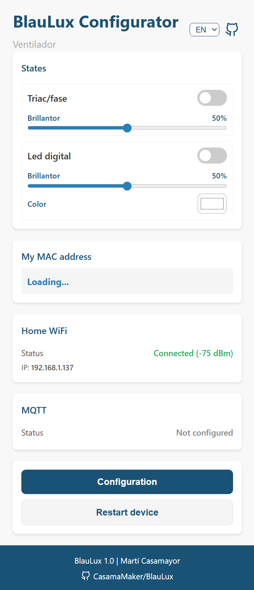

<div align="center">

# BlauLux ⚡

**Smart AC load controller based on ESP32**

[](https://github.com/CasamaMaker/BlauLux/releases)
[](https://github.com/CasamaMaker/BlauLux/releases/latest)
[](https://platformio.org/)
[](https://www.arduino.cc/)
[](LICENSE)
[](https://www.espressif.com/en/products/socs/esp32-c3)
[](https://www.espressif.com/en/solutions/low-power-solutions/esp-now)
[](https://www.home-assistant.io/)

[English](README.md) |
[Català](README.cat.md) |
[Español](README.es.md)
---

<!--
  📸 PHOTO 1 — MAIN PROJECT IMAGE
  Description: Photo of the BlauLux device assembled and running.
  Ideally: ESP32-C3 board with WS2812 LED on (green or white),
  connected to a light or LED strip. Horizontal format, neutral or dark background.
  Recommended resolution: 1200×600 px or higher.
  Place the image at: docs/img/hero.jpg
-->
<!--  -->

*Receiver side of the **Blau** ecosystem — receives wireless commands from an ESP-NOW button and controls the connected load.*

</div>

---

[🌐 Ecosystem](#blau-ecosystem) · [✨ Features](#features) · [🎛️ Modes](#control-modes) · [🔌 Hardware](#hardware) · [🚀 Getting started](#getting-started) · [⚙️ Configuration](#configuration) · [📖 Usage](#usage) · [🏠 MQTT & HA](#mqtt-and-home-assistant) · [📡 Protocol](#blauprotocol) · [📁 Structure](#project-structure) · [🔧 Troubleshooting](#troubleshooting) · [🔗 Related](#related-projects)

---

## 🌐 Blau Ecosystem

BlauLux is the **receiver** of a complete wireless system for controlling lights and AC loads without a router or hub:

```
┌─────────────────┐    ESP-NOW (IEEE 802.11)   ┌──────────────────┐
│    BlauClick    │ ─────────────────────────► │     BlauLux      │
│  (button sender)│ ◄───────────── ACK ──────  │  (load receiver) │
│  Battery · BLE  │                            │  ESP32  ·   WiFi │
└─────────────────┘                            └────────┬─────────┘
                                                        │
                                          ┌─────────────┼─────────────┐
                                          ▼             ▼             ▼
                                        Relay        RGB LED        Triac
                                      (On/Off)     (NeoPixel)   (AC dimmer)
```

Communication is **peer-to-peer at the MAC layer**, without any router in between. Latency is < 10 ms and power consumption is minimal. A single BlauLux can handle up to **8 BlauClicks** simultaneously.

<!--
  📸 PHOTO 2 — PHYSICAL DIAGRAM OR FULL ASSEMBLY
  Description: Photo of both devices together (BlauClick + BlauLux),
  or a printed/hand-drawn block diagram showing the connection.
  Horizontal format. White or light background for contrast.
  Place the image at: docs/img/ecosystem.jpg
-->
<!--  -->

---

## ✨ Features

- 📡 **Communication** ESP-NOW peer-to-peer without router (latency < 10 ms)
- ✅ **Reliability** ACK for every command + 3 automatic retries on the sender
- 🔁 **Deduplication** discards duplicate packets within a 2 s window
- 🌐 **Configuration** web captive portal (CA / EN / ES) without any app
- 💾 **Persistence** configuration saved to NVS (survives power cuts)
- 🏠 **Home automation** WiFi STA + MQTT + Home Assistant auto-discovery
- 🔘 **Physical button** quick toggle and entry to config mode via long press
- 👥 **Multi-source** up to 8 BlauClicks per BlauLux
- 🖥️ **Platforms** ESP32-C3 · ESP32 · ESP32-S3 · ESP32-S2 · ESP32-C6
- 🔧 **Firmware** v1.0 — PlatformIO + Arduino framework

---

## 🎛️ Control Modes

BlauLux supports **4 control types** selectable via the web interface:

| Mode | Description | Typical hardware |
|------|-------------|-----------------|
| **On/Off** | Binary digital output | Relay, MOSFET, LED |
| **PWM** | 1 LEDC channel (5 kHz / 8-bit) | Monochrome LED strip or dual WW+CW |
| **Triac cycle** | Per-cycle control at 50 Hz (no ZCD) | Simple AC dimmer |
| **Triac phase** | Phase control with ZCD (H11AA4 + MOC3021S) | Precision AC dimmer |
| **Digital LED** | NeoPixel/WS2812 control | WS2812 LED strip |

---

## 🔌 Hardware

### 📋 Device Templates

The web interface offers **predefined templates** for some devices:

| Template | Pre-configured GPIOs | Use |
|----------|---------------------|-----|
| `PICO-CLICK` | BTN\_INV→5 · LED→6 | Generic prototyping board |
| `SONOFF_BASIC_R4` | BTN→9 · RELAY→4 · LED→6 | Sonoff wall switch |
| `AC_REGULATOR` | BTN→1 · ZCD→0 · TRIAC→4 · LED→5 | Phase AC dimmer |
| `GL-C-309WL` | BTN→17 · LED→16 · ON\_OFF→18 | Digital light strip control |

### 🔧 Connections

**PICO-CLICK (default):**
```
GPIO 5  →  Button (pull-down, pressed = HIGH)
GPIO 6  →  NeoPixel / WS2812 data
```

**SONOFF BASIC R4:**
```
GPIO 9  →  Built-in button (pull-up, pressed = LOW)
GPIO 4  →  Relay control
GPIO 6  →  Status LED
```

**Phase AC dimmer (AC_REGULATOR):**
```
GPIO 0  →  ZCD — H11AA4 optocoupler output (active HIGH pulse at zero-crossing)
GPIO 4  →  Triac gate — MOC3021S optocoupler input (active HIGH to trigger)
GPIO 5  →  WS2812 (status LED — amber proportional to power)
GPIO 1  →  Configuration button
```

> The firing delay is calculated as: `delay = (100 − power%) × 10 ms / 100`.
> Designed for 50 Hz mains. The triac trigger pulse is 100 µs.

<!--
  📸 PHOTO 3 — WIRING DIAGRAM / CONNECTIONS
  Description: Screenshot of the schematic (Fritzing, KiCad, EasyEDA)
  or photo of the breadboard assembly showing connections clearly.
  For triac mode: include the H11AA4 and MOC3021S with RC snubber network.
  Horizontal format. Visible pin labels.
  Place the image at: docs/img/wiring.png
-->
<!--  -->

---

## 🚀 Getting Started

### 📦 Requirements

- [PlatformIO](https://platformio.org/) (CLI or VSCode extension)
- USB-C cable
- ESP32-C3 board (or compatible — see templates)
- USB-UART driver if needed (CH340, CP210x)

### 💾 Build and Flash

1. Clone the repository:
   ```bash
   git clone https://github.com/CasamaMaker/BlauLux.git
   cd BlauLux/firmware/BlauLux
   ```

2. (Optional) Edit [`src/config.h`](src/config.h) to select the target or adjust parameters.

3. Compile and upload the firmware:
   ```bash
   pio run -e esp32c3 -t upload
   ```

4. Upload the filesystem (web interface):
   ```bash
   pio run -e esp32c3 -t uploadfs
   ```

5. Open the serial monitor to verify boot:
   ```bash
   pio device monitor -b 115200
   ```

**Available environments:** `esp32c3` · `esp32` · `esp32s3` · `esp32s2` · `esp32c6`

### 🔑 Initial Setup

On first boot (or after clearing the config), the device detects that no button GPIO or WiFi credentials are configured and automatically enters AP mode:

1. Power on the BlauLux.
2. From your phone or computer, connect to the **`BlauLux_XXXX`** network (the last 4 characters of the MAC).
3. The captive portal opens automatically — or browse to `http://192.168.4.1`.
4. Select the control type, assign GPIO functions and extra parameters.
5. Press **Save**. The device restarts and enters normal operation.

<!--
  📸 PHOTO 4 — CONFIGURATION WEB PORTAL
  Description: Screenshot of the captive portal open on a phone or desktop browser.
  Should show the main configuration form with:
  control type selection, GPIO assignment, brightness slider.
  Two captures: one on mobile (portrait) and one on desktop (landscape).
  Place the images at: docs/img/portal_mobile.png and docs/img/portal_desktop.png
-->
<!--  -->
<!--  -->

<p align="center">
  
</p>

---

## ⚙️ Configuration

### 🕐 Compile-time (`config.h`)

| Macro | Default | Description |
|-------|---------|-------------|
| `CLEAR_CONFIG` | *(commented out)* | If defined, wipes all NVS on boot. Comment back and re-upload afterwards. |
| `WIFI_SSID` | `"BlauLux"` | AP network name prefix (MAC suffix added automatically) |
| `WIFI_PASSWORD` | `""` | AP password (empty = open network) |
| `BRIGHTNESS_DEF` | `15` | Default brightness (0–100 %) |
| `PWM_FREQ` | `5000` | LEDC frequency in Hz |
| `PWM_RESOLUTION` | `8` | PWM resolution in bits (8 → range 0–255) |
| `WIFI_AP_HOLD_MS` | `3000` | Button hold duration (ms) to enter config mode |
| `WIFI_AP_TIMEOUT_MS` | `120000` | Maximum time in AP mode before restarting |
| `ESPNOW_CHANNEL` | `1` | WiFi channel for ESP-NOW |
| `ENABLE_WIFI_STA` | *(defined)* | Comment to disable home network connection |
| `ENABLE_MQTT` | *(defined)* | Comment to disable MQTT client |
| `LOG_LEVEL` | `3` | 0=silent · 1=error · 2=info · 3=debug |
| `CONFIG_SCHEMA_VERSION` | `4` | Increment when changing NVS keys |
| `FIRMWARE_VERSION` | `"1.0"` | Firmware version (string) |

### 🌍 Runtime (Web UI)

All hardware parameters can be changed from the web interface (`http://192.168.4.1`):

- **Device template** — predefined GPIO function selection
- **GPIO assignment** — function for each pin (BTN, ON\_OFF, PWM, ZCD, TRIAC...)
- **Brightness** — default value (0–100 %)
- **WiFi STA** — connection to home network to enable MQTT
- **MQTT** — broker, credentials, and topic templates
- **Live preview** — test RGB color or brightness before saving

---

## 📖 Usage

### 🔘 Physical Button

| Action | Result |
|--------|--------|
| Short press | Toggle the load (on/off) |
| Hold 3+ s | Enter WiFi configuration AP mode |
| Double press (in AP mode) | Exit AP mode and restart |

AP mode has an automatic 2-minute timeout (`WIFI_AP_TIMEOUT_MS`).

### 📡 Remote Control via BlauClick

BlauLux listens for ESP-NOW packets from BlauClick devices. No pairing or router needed — communication is peer-to-peer at the WiFi MAC layer.

Upon receiving a valid BlauProtocol packet, BlauLux:

1. Verifies the CRC-8 checksum.
2. Discards duplicates (same `src_id` + `seq` within 2 seconds).
3. Executes the command (toggle, on, off, brightness, color...).
4. Sends an ACK packet to the sender with the current device state.

**Supported commands:** `TOGGLE` · `ON` · `OFF` · `SET_BRIGHTNESS` · `SET_RGB` · `SET_CCT` · `SET_SCENE` · `DIM_UP` · `DIM_DOWN`

<!-- **Supported button events:** `CLICK_1` (1 click) · `CLICK_2` (double click) · `CLICK_3` (triple click) · `LONG_START/END` (long press) -->

### 🌐 Web Interface

The HTTP API is accessible at `http://192.168.4.1` while the device is in AP mode:

| Endpoint | Method | Description |
|----------|--------|-------------|
| `/` | `GET` / `POST` | Configuration page / save new config to NVS |
| `/color` | `POST` | Preview RGB color (`r`, `g`, `b`, 0–255) |
| `/dutty` | `POST` | Preview brightness (`value`, 0–100) |
| `/duttyCW` | `POST` | Preview cool white (`value`, 0–100, mode 3/4) |
| `/wifi` | `POST` | Save WiFi STA credentials and reconnect |
| `/mqtt` | `POST` | Save MQTT config and reconnect |
| `/mymac` | `POST` | Returns the AP MAC address |
| `/pins` | `POST` | Returns GPIO assignment (JSON) |
| `/brightness` | `POST` | Returns brightness per mode (JSON) |
| `/wifiStatus` | `POST` | Returns WiFi STA connection status (JSON) |
| `/mqttStatus` | `POST` | Returns MQTT status and config (JSON) |
| `/initialSetup` | `POST` | Returns `"true"` if no button GPIO is configured |

---

## 🏠 MQTT and Home Assistant

When a WiFi STA network is configured, BlauLux connects to an MQTT broker and publishes/subscribes to topics defined in `config.h`:

```
BlauLux/<topic>/state      ← current state (ON / OFF, brightness, color)
BlauLux/<topic>/cmnd/...   ← incoming commands
BlauLux/<topic>/tele/...   ← telemetry (LWT, IP, MAC, RSSI)
```

Where `%id%` is automatically resolved as the **last 4 characters of the MAC** (e.g. `A1B2`), giving each device unique topics with no additional configuration.

> **Home Assistant:** BlauLux publishes the standard MQTT auto-discovery payload so the device appears automatically in HA without any manual configuration.

<!--
  📸 PHOTO 5 — HOME ASSISTANT
  Description: Screenshot of the Home Assistant panel showing
  the BlauLux device integrated: entities (light, switch), history,
  or the dashboard with the light control.
  Place the image at: docs/img/homeassistant.png
-->
<!--  -->

---

## 📡 BlauProtocol

BlauLux uses **BlauProtocol v1** — a compact **10-byte** binary protocol designed for ESP-NOW:

```
Byte:  0      1      2      3-4        5      6    7    8    9
      [VER | TYPE | SEQ | SRC_ID(2B) | CMD | P1 | P2 | P3 | CRC8]
```

| Field | Size | Description |
|-------|------|-------------|
| `VER` | 1 B | Protocol version (`0x01`) |
| `TYPE` | 1 B | Message type (EVENT, CMD, ACK, PING...) |
| `SEQ` | 1 B | Circular sequence number (0–255) for deduplication |
| `SRC_ID` | 2 B | Sender identifier (last 2 bytes of the MAC) |
| `CMD` | 1 B | Command or event code |
| `P1–P3` | 3 B | Parameters (brightness, R/G/B, WW/CW...) |
| `CRC8` | 1 B | CRC-8 (polynomial 0x07) of bytes 0–8 |

**Message types:** `TYPE_EVENT` · `TYPE_CMD` · `TYPE_ACK` · `TYPE_PING` · `TYPE_PONG` · `TYPE_STATUS_REQ` · `TYPE_STATUS_RSP`

**ACK codes:** `ACK_OK` · `ACK_ERROR` · `ACK_DUPLICATE` · `ACK_UNAUTHORIZED` · `ACK_BAD_VERSION` · `ACK_BAD_CRC`

**Timings:**

| Constant | Value | Description |
|----------|-------|-------------|
| `BLAU_ACK_TIMEOUT_MS` | 50 ms | ACK wait time per attempt |
| `BLAU_MAX_RETRIES` | 3 | Maximum retries without ACK |
| `BLAU_CLICK_WINDOW_MS` | 400 ms | Multi-click detection window |
| `BLAU_LONG_PRESS_MS` | 800 ms | Long press threshold |
| `BLAU_DEDUP_WINDOW_MS` | 2000 ms | Deduplication window at the Trigger |
| `BLAU_MAX_SOURCES` | 8 | Maximum BlauClicks per Trigger |
| `BLAU_MAX_TARGETS` | 4 | Maximum Triggers per BlauClick |

Full specification: [`lib/BlauProtocol/blauprotocol.h`](lib/BlauProtocol/blauprotocol.h)

---

## 📁 Project Structure

```
BlauLux/
├── src/
│   ├── main.cpp          # Main logic, setup, loop
│   ├── config.h          # Pinout, compile-time macros, constants
│   ├── globals.h         # Global variable declarations
│   ├── nvsconfig.h/.cpp  # NVS persistence (Preferences)
│   ├── output.h/.cpp     # Output control (relay, PWM, NeoPixel, triac)
│   ├── espnow.h/.cpp     # ESP-NOW receiver and BlauProtocol processing
│   ├── webserver.h/.cpp  # HTTP server and captive portal
│   ├── mqtt.h/.cpp       # MQTT client and HA auto-discovery
│   ├── button.h/.cpp     # Button management (debounce, multi-click, long press)
│   └── watchdog.h/.cpp   # Watchdog and reset reason logging
├── lib/
│   └── BlauProtocol/
│       ├── blauprotocol.h        # Packet structure, types, constants
│       ├── blauprotocol.cpp      # CRC-8, packet initialisation
│       ├── blauprotocol_trg.h    # Trigger helpers (parse, dedup, ACK)
│       └── blauprotocol_link.h   # Link helpers (sender)
├── data/
│   ├── wifimanager.html   # Multilingual web UI (CA / EN / ES via JS i18n)
│   └── style.css          # Web interface styles
└── platformio.ini         # PlatformIO configuration (multi-target)
```

---

## 🔧 Troubleshooting

| Problem | Likely cause | Solution |
|---------|-------------|---------|
| Always in AP mode on boot | Button GPIO not configured | Connect to the portal and save pin assignment |
| Captive portal does not open | Blocked by network or DNS | Browse manually to `http://192.168.4.1` |
| LED does not turn on | Incorrect pin or control mode | Verify GPIO and mode in the web portal |
| No ACK reaching BlauClick | Dedup window expired or packet lost | BlauClick retries up to 3 times; check that the ESP-NOW channel matches (`ESPNOW_CHANNEL`) |
| Config not saved | NVS full or corrupt | Define `CLEAR_CONFIG`, upload firmware, comment it back and re-upload |
| Compilation error | Library not found | Run `pio pkg install` to download dependencies |
| USB port not detected | Missing driver | Install the CH340 or CP210x driver for your OS |
| Device restarting on its own | Watchdog timeout | Check the serial monitor for the reset reason (`logResetReason`) |

---

## 🔗 Related Projects

- **[BlauClick](https://github.com/CasamaMaker/BlauClick)** — Wireless battery-powered button (ecosystem sender)

---

## 📜 License

This project is open source. See [LICENSE](LICENSE) for details.

---

<div align="center">

Made with ❤️ by [CasamaMaker](https://github.com/CasamaMaker)

</div>
